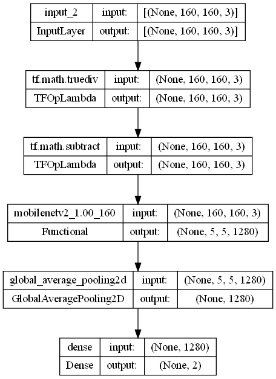
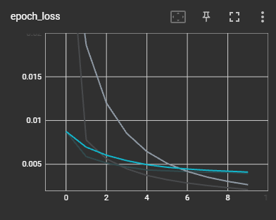
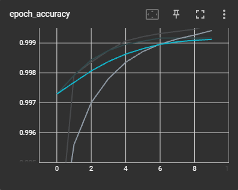
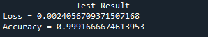
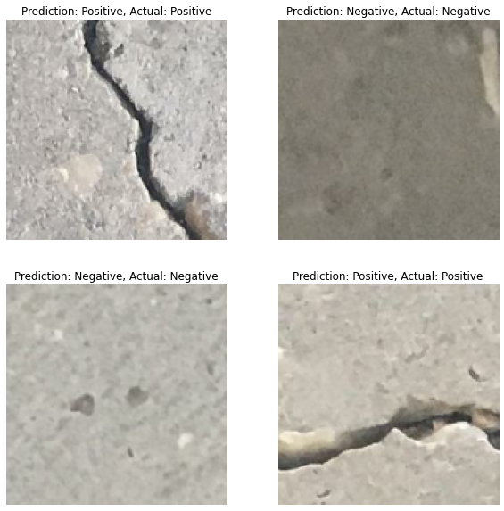

# Recognizing Cracks on Concrete with Image Classification using CNN
## 1. Summary
The purpose of this project is to create a convolutional neural network that can accurately identify whether there are cracks in concerete. The model is trained with a dataset of 40000 images (20000 images of concrete in good condition and 20000 images of concrete with cracks), from [Productivity Prediction of Garment Employees](https://www.kaggle.com/datasets/ishadss/productivity-prediction-of-garment-employees).

## 2. IDE and Framework
This project is created using Sypder as the main IDE. The main frameworks used in this project are Pandas, Numpy, Scikit-learn and TensorFlow Keras.

## 3. Methodology
### 3.1. Data Pipeline
The picture with its labels are first loaded and preprocessed. The data is first split into train-validation set, with a ratio of of 70:30. The validation data is then divided into two portions in an 80:20 ratio to obtain test data. The overall train-validation-test split ratio is 70:24:6. No data augmentation is applied as the data size and variation are already sufficient.

### 3.2. Model Pipeline
The input layer is intended to receive coloured pictures with a size of 160x160 pixels. The final form will be (160,160,3).

This project's deep learning model is built via transfer learning. To begin, a preprocessing layer is established, which changes the pixel values of the input pictures to a range of -1 to 1. This layer functions as a feature scaler and is required for the transfer learning model to produce the right signals.

A pretrained MobileNet v2 model is employed for feature extraction. With ImageNet pretrained parameters, the model is readily available within the TensorFlow Keras package. It's also locked, so it won't update throughout model training.

As the classifier, a global average pooling and dense layer are employed to generate softmax signals. The predicted class is identified using the softmax signals.

The model is shown in figure in a simplified form in the image below.

The model is trained with a batch size of 16 and for 10 epochs. After training, the model reaches 99% training accuracy and 99% validation accuracy. The training results are shown in the figures below.

 

The graphs clearly show evidence of convergence, showing that the model has been trained to achieve an optimal level of accuracy and loss.

## 4. Results
The model is evaluated with the test data. The loss and accuracy are shown in figure below.

Below are four images with accurate prediction made

